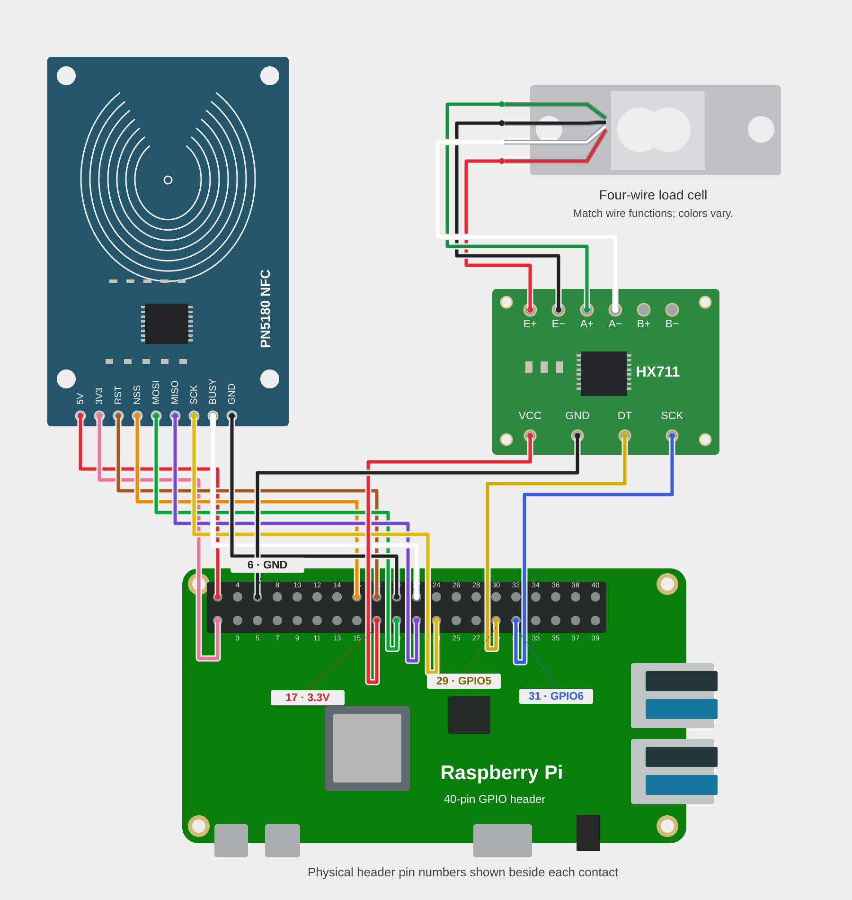

# SpoolBuddy Hardware Setup

## Scale board selection

NAU7802 is the default scale board. Select the board connected to your Pi during
installation. If you use an HX711, follow the [optional HX711 setup](#hx711-optional)
below.

## PN5180 NFC Reader (SPI)

### Wiring

| PN5180 Pin | Raspberry Pi Pin | GPIO | Wire Color |
|------------|------------------|------|------------|
| 3V3        | Pin 1            | —    | Red        |
| 5V         | Pin 2            | —    | Red        |
| GND        | Pin 20           | —    | Black      |
| SCK        | Pin 23           | GPIO11 | Yellow   |
| MISO       | Pin 21           | GPIO9  | Blue     |
| MOSI       | Pin 19           | GPIO10 | Green    |
| NSS (CS)   | Pin 16           | GPIO23 | Orange   |
| BUSY       | Pin 22           | GPIO25 | White    |
| RST        | Pin 18           | GPIO24 | Brown    |

> **Power:** The PN5180 board has two power pins. 3V3 powers the IC itself,
> 5V powers the antenna booster and extends read range. Both should be connected.
> Do NOT connect 5V to the 3V3 pin — it will destroy the reader.

> **NSS:** We use GPIO23 for manual chip-select instead of the default SPI CE0
> (GPIO8) because the kernel SPI driver's automatic CS timing does not meet the
> PN5180's requirements (5µs setup, 100µs hold). The reader's NSS line is wired
> to GPIO23 only, so whether the kernel auto-toggles CE0 is electrically
> invisible to the PN5180. Pi 4 and Pi 5 are both supported — the code asks
> the driver to disable CE0 toggling but tolerates Pi 5's RP1 driver rejecting
> that request (#1424).

### Setup Steps

#### 1. Enable SPI and I2C

After a fresh Raspberry Pi OS install, SPI and I2C are disabled by default.

```bash
sudo raspi-config
# Navigate to: Interface Options -> SPI -> Enable
# Navigate to: Interface Options -> I2C -> Enable
sudo reboot
```

Verify after reboot:

```bash
ls /dev/spidev0.*
# Should show: /dev/spidev0.0  /dev/spidev0.1

ls /dev/i2c-*
# Should include: /dev/i2c-1
```

#### 2. Configure `/boot/firmware/config.txt`

Add the following lines under the `[all]` section:

```
# SpoolBuddy: I2C bus 1 for NAU7802 scale (GPIO2/GPIO3)
dtparam=i2c_arm=on

# SpoolBuddy: Disable SPI auto CS (manual CS on GPIO23 for PN5180)
dtoverlay=spi0-0cs
```

- `i2c_arm=on` enables I2C bus 1 (GPIO2/GPIO3). The NAU7802 is wired to bus 1.
  manual CS on GPIO23 because the driver's CS timing doesn't meet the PN5180's

Then reboot:

```bash
sudo reboot
```

Verify after reboot:

```bash
ls /dev/i2c-1
# Should exist

sudo i2cdetect -y 1
# Should show 0x2A (NAU7802)
```

#### 3. Install system packages

```bash
sudo apt install python3-spidev python3-libgpiod gpiod libgpiod3 i2c-tools
```

- `python3-spidev` / `libgpiod3` — system libraries for SPI and GPIO access
- `gpiod` — command-line GPIO tools (useful for debugging)

```bash
pip install spidev gpiod smbus2
```

- `spidev` — Python SPI bindings (PN5180 NFC reader)
- `gpiod` — Python GPIO bindings via libgpiod (works on both RPi 4 and RPi 5)

Wago connectors or breadboard jumpers are unreliable for SPI — the PN5180
is very sensitive to signal integrity issues (loose connections cause RF
field flickering, phantom errors, and intermittent communication failures).
**Solder all wires directly** for reliable operation.

#### 6. Verify hardware communication

Run the diagnostic script to confirm the PN5180 is responding:

```bash
sudo python3 spoolbuddy/pn5180_diag.py
```

Expected output includes product version (e.g. `v4.0`), firmware version,
register dump, and "Diagnostics complete" at the end.

#### 7. Test tag reading

```bash
sudo python3 spoolbuddy/read_tag.py
```

Place a tag on the reader. Supported tag types:

| Tag Type            | SAK    | Use Case                     |
|---------------------|--------|------------------------------|
| MIFARE Classic 1K   | `0x08` | Bambu Lab filament tags      |
| MIFARE Classic 4K   | `0x18` | Bambu Lab filament tags      |
| NTAG (213/215/216)  | `0x00` / `0x04` | SpoolEase / OpenPrintTag     |

### Troubleshooting

| Symptom | Cause | Fix |
|---------|-------|-----|
| All zeros from SPI reads | SPI not enabled | Run `raspi-config` and enable SPI, then reboot |
| `GENERAL_ERROR` on SEND_DATA | Automatic CS timing too fast | Use manual CS on GPIO23 with `spi0-0cs` overlay |
| `BUSY timeout` | Wiring issue or RST not connected | Check RST and BUSY pin connections |
| RF field flickering on/off | Loose power wires | Solder all connections |
| `No tag found` but tag is present | Wrong protocol or missing `setTransceiveMode()` | Ensure ISO 14443A config (`0x00, 0x80`) and `setTransceiveMode()` before every `SEND_DATA` |
| Auth failed for block N | Wrong key derivation | Verify HKDF uses context `"RFID-A\0"` (7 bytes including null terminator) |
| `EBUSY` when requesting GPIO8 | Kernel SPI driver owns CE0 | Use GPIO23 for NSS instead |

### Technical Notes

- SPI speed: **500 kHz** (higher speeds cause communication errors)
- SPI mode: **0** (CPOL=0, CPHA=0)


### Wiring

| NAU7802 Pin | Raspberry Pi Pin | GPIO   | Wire Color |
|-------------|------------------|--------|------------|
| VCC         | Pin 1            | —      | Red        |
| SDA         | Pin 3            | GPIO 2 | Yellow     |
| SCL         | Pin 5            | GPIO 3 | White      |
| GND         | Pin 30           | —      | Black      |

> **I2C Bus:** Uses I2C bus 1 (GPIO2/GPIO3), enabled via `dtparam=i2c_arm=on`
> in config.txt.

### Verify

```bash
sudo i2cdetect -y 1
# Should show 0x2A

sudo python3 spoolbuddy/scale_diag.py
```

The diagnostic reads 10 samples at 10 SPS and shows raw ADC values, average,
and spread. Typical idle readings are around ~500k with a spread under 20k.

## HX711 (optional)

### Installation

HX711 is an optional alternative to the default NAU7802 scale board. Use this
guide if your load-cell amplifier is an HX711. Raspberry Pi OS 64-bit is required.

Choose **HX711** when the installer asks which scale board is connected.
To select HX711 from the command line in a Bambuddy checkout, use:

```bash
sudo ./spoolbuddy/install/install.sh --scale-driver hx711
```

### HX711 wiring

Power off before wiring. These connections are for a single-supply HW-031 HX711
board. Use the PN5180 wiring above for the NFC reader.



*Numbers beside the Pi header are physical pin numbers.*

Board layouts vary; follow the terminal labels. Power this board from 3.3V
when connecting it directly to the Pi's GPIO pins.
Match the load cell's excitation wires to E+/E− and signal wires to A+/A−;
wire colors vary between kits. Leave B+ and B− unused, and leave slack in the
wires so they do not pull on the load cell.

### Calibration

1. Leave the platform empty and let the reading settle.
2. In SpoolBuddy's Scale settings, select **Tare**.
3. Select **Calibrate** and follow the prompts using an object of known weight.

Movement of the desk, tension on the wires and temperature changes can affect
the reading. If the empty platform shows an offset, let it settle before taring.
Recalibrate after changing the load cell or scale board.

### Diagnostics

Use the scale diagnostic in SpoolBuddy to check readings without changing
calibration. To run it from a terminal on the Pi:

```bash
cd /opt/bambuddy/spoolbuddy
venv/bin/python scripts/scale_diag.py
```

Use your installation directory if it differs from `/opt/bambuddy`. The command
uses the scale board selected during installation.

### Troubleshooting

If the scale is unavailable, check its service and recent messages:

```bash
systemctl status spoolbuddy-hx711.service
journalctl -u spoolbuddy-hx711.service -n 40 --no-pager
```

| Result | What to check |
|---|---|
| No reading | Power off and check power, ground, DT and SCK connections. |
| Saturated or invalid reading | Check the load-cell connections and mechanical load. Tare cannot correct a saturated input. |
| No HX711 device found | Check the service messages and confirm the configured pins match the wiring. |
| Module not found after an OS update | Follow the update checks below. |
| Permission denied | Save the diagnostic output and service messages for support. |

After correcting the cause, restart the scale service and SpoolBuddy:

```bash
sudo systemctl restart spoolbuddy-hx711.service
sudo systemctl restart spoolbuddy.service
```

#### Updates and reinstalling

Reinstalling preserves the selected board and saved configuration unless you
choose to change them. Saved calibration is kept with the device in Bambuddy.

OS kernel updates automatically rebuild the HX711 driver through DKMS when the
OS does not provide it. If the scale stops working after an update, compare:

```bash
uname -r
dkms status
```

There should be an `installed` entry for the running kernel. No DKMS entry is
needed when the OS supplies its own HX711 driver. If the module is missing,
rerun the installer with HX711 selected. Save any build error if it fails.

For updates to the HX711 driver or its startup service, rerun the installer;
these are not installed by the ordinary application updater.
